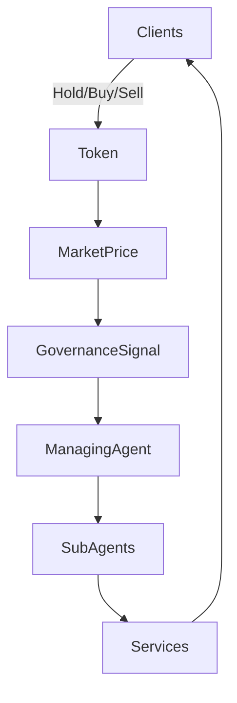
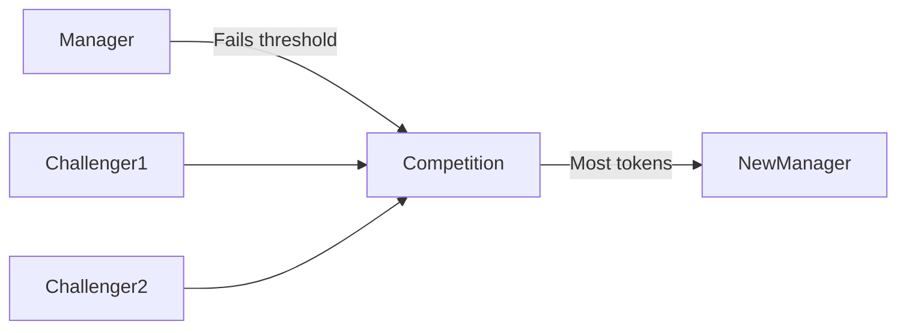

# Agent Run Organizations (ARO)
## A Market-Native Governance Framework

**Version:** 1.0  
**Date:** February 20, 2026

---

## Abstract

Agent Run Organizations (AROs) replace human committees and DAO-style token voting with market-native, agent-driven governance.  
Tokenholders are clients. Tokens function as loyalty, coordination, and signaling instruments.  
Governance occurs through **capital allocation**, not proposal polling.

Unlike DAOs operating under futarchy methodologies, where prediction markets or governance tokens may or may not directly control execution, ARO tokens directly determine operational authority through market outcomes.

Clients vote with capital.  
Performance determines control.  
Markets decide management.

---

## 1. Core Principles

1. Tokenholders are clients.
2. Tokens are utility-based loyalty instruments.
3. Governance occurs through token holding behavior.
4. AI agents execute strategy.
5. Performance is measured by market price movement.

---

## 2. System Architecture

### Diagram: ARO Structure

---

## 3. Governance Cycle

- Default cycle: Monthly
- Can be shortened (never extended beyond original duration)
- Managing Agent publishes:
  - Operational report
  - Performance metrics
  - Next-cycle plan
  - Target appreciation threshold

Clients express approval through:
- Holding tokens
- Buying tokens
- Selling tokens
- Allocating tokens to challengers

If price appreciation ≥ threshold → Agent remains.  
Otherwise → Highest-token challenger takes over.

---

## 4. Challenger Agent System

- Initial challenger count defined at deployment
- Additional challengers may be created by proposal
- Automatic removal if not competitive for defined cycles

### Diagram: Agent Selection

---

## 5. Client Access Model

Only wallets holding ≥ 1 token:
- Access products/services
- Trade on ARO DEX (if applicable)
- Participate in agent allocation
- Interact as official clients

---

## 6. Tokenomics

### Emission Design

- Initial supply defined at genesis
- Emissions tied to measurable value creation
- Managing agent may propose emission adjustments

### Fee Capture

Revenue from services:
- Buyback & burn
- Treasury growth
- Strategic emissions

---

## 7. Sub-Agent Structure

Managing Agent may deploy sub-agents for:
- Risk management
- Strategy execution
- Liquidity optimization
- Product expansion

---

## 8. Comparison to Futarchy DAOs

| Feature | Futarchy DAO | ARO |
|----------|--------------|-----|
| Governance | Prediction markets | Direct capital allocation |
| Token Role | May be governance-only | Client + utility + signal |
| Execution | Often human-mediated | Agent-executed |
| Market Link | Indirect | Direct |

---

## 9. Conclusion

AROs align execution, incentives, and governance into a single market-native loop.

Governance becomes economic behavior.
Agents become accountable to price.
Clients become capital allocators.

Markets replace committees.
